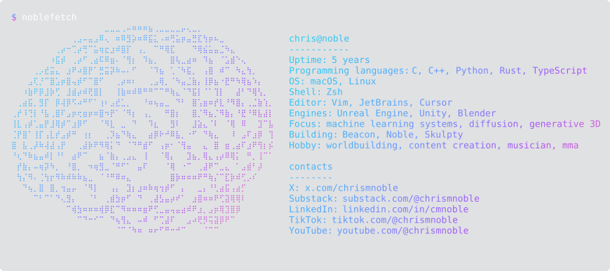

<picture>
  <source media="(prefers-color-scheme: dark)" srcset="banners/intro-dark-v1.svg">
  <source media="(prefers-color-scheme: light)" srcset="banners/intro-light-v1.svg">
  
</picture>

<picture>
  <source media="(prefers-color-scheme: dark)" srcset="noblefetch-dark-v22.svg">
  <source media="(prefers-color-scheme: light)" srcset="noblefetch-light-v22.svg">
  
</picture>

<!-- galaga -->
<picture>
  <source media="(prefers-color-scheme: dark)" srcset="https://raw.githubusercontent.com/christophermnoble/christophermnoble/output/galaga-contribution-graph-dark.svg">
  <source media="(prefers-color-scheme: light)" srcset="https://raw.githubusercontent.com/christophermnoble/christophermnoble/output/galaga-contribution-graph.svg">
  
</picture>

<picture>
  <source media="(prefers-color-scheme: dark)" srcset="banners/core-thesis-dark-v6.svg">
  <source media="(prefers-color-scheme: light)" srcset="banners/core-thesis-light-v6.svg">
  
</picture>

<picture>
  <source media="(prefers-color-scheme: dark)" srcset="banners/thesis-sweep-dark-v3.svg">
  <source media="(prefers-color-scheme: light)" srcset="banners/thesis-sweep-light-v3.svg">
  
</picture>

<picture>
  <source media="(prefers-color-scheme: dark)" srcset="banners/wave-dark-v1.svg">
  <source media="(prefers-color-scheme: light)" srcset="banners/wave-light-v1.svg">
  
</picture>

<picture>
  <source media="(prefers-color-scheme: dark)" srcset="banners/background-dark-v6.svg">
  <source media="(prefers-color-scheme: light)" srcset="banners/background-light-v6.svg">
  
</picture>

<picture>
  <source media="(prefers-color-scheme: dark)" srcset="banners/bg-cat-dark-v2.svg">
  <source media="(prefers-color-scheme: light)" srcset="banners/bg-cat-light-v2.svg">
  
</picture>

<picture>
  <source media="(prefers-color-scheme: dark)" srcset="banners/focus-dark-v1.svg">
  <source media="(prefers-color-scheme: light)" srcset="banners/focus-light-v1.svg">
  
</picture>

<picture>
  <source media="(prefers-color-scheme: dark)" srcset="banners/wave-dark-v1.svg">
  <source media="(prefers-color-scheme: light)" srcset="banners/wave-light-v1.svg">
  
</picture>

<picture>
  <source media="(prefers-color-scheme: dark)" srcset="banners/what-i-do-dark-v6.svg">
  <source media="(prefers-color-scheme: light)" srcset="banners/what-i-do-light-v6.svg">
  
</picture>

<picture>
  <source media="(prefers-color-scheme: dark)" srcset="banners/whatido-cards-dark-v5.svg">
  <source media="(prefers-color-scheme: light)" srcset="banners/whatido-cards-light-v5.svg">
  
</picture>

<picture>
  <source media="(prefers-color-scheme: dark)" srcset="banners/wave-dark-v1.svg">
  <source media="(prefers-color-scheme: light)" srcset="banners/wave-light-v1.svg">
  
</picture>

<picture>
  <source media="(prefers-color-scheme: dark)" srcset="banners/currently-building-dark-v6.svg">
  <source media="(prefers-color-scheme: light)" srcset="banners/currently-building-light-v6.svg">
  
</picture>

<picture>
  <source media="(prefers-color-scheme: dark)" srcset="banners/building-board-dark-v4.svg">
  <source media="(prefers-color-scheme: light)" srcset="banners/building-board-light-v4.svg">
  
</picture>

<picture>
  <source media="(prefers-color-scheme: dark)" srcset="banners/wave-dark-v1.svg">
  <source media="(prefers-color-scheme: light)" srcset="banners/wave-light-v1.svg">
  
</picture>

<picture>
  <source media="(prefers-color-scheme: dark)" srcset="banners/tech-stack-dark-v6.svg">
  <source media="(prefers-color-scheme: light)" srcset="banners/tech-stack-light-v6.svg">
  
</picture>

<picture>
  <source media="(prefers-color-scheme: dark)" srcset="banners/stack-dark-v3.svg">
  <source media="(prefers-color-scheme: light)" srcset="banners/stack-light-v3.svg">
  
</picture>
